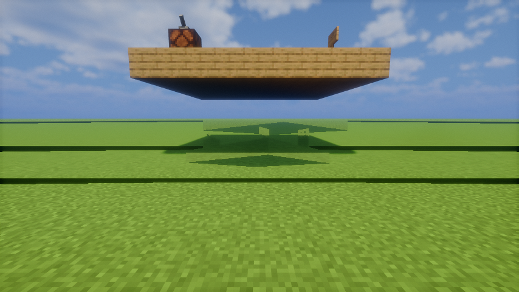

# Slipway

[](https://github.com/TimStewartJ/slipway/actions/workflows/ci.yml)

Moving physics block structures for Minecraft 26.3 (Fabric). Build a structure from any blocks, place a Slipway
Helm on it, assemble it into a vessel and fly it with full pitch, yaw and roll. The blocks stay real blocks: chests,
furnaces, doors, levers and redstone keep working while the vessel moves, and you can walk on the deck and build on it
at any angle. Physics by [Jolt Physics](https://github.com/jrouwe/JoltPhysics) through
[jolt-jni](https://github.com/stephengold/jolt-jni).



*Screenshots are taken by the automated client tests (flat test worlds, simple test ships).*

## How this was made: AI-built proof of concept

Slipway was written almost entirely by AI coding agents running through GitHub Copilot, from a design and a set of
goals by [Tim Stewart](https://github.com/TimStewartJ). The agents wrote the code, the tests and the documentation,
ran the test suites, and diagnosed their own bugs, including a world-memory leak traced into Distant Horizons. A
human set the direction, reviewed the results and playtested.

Treat it as a proof of concept: it works and is heavily tested, but it is young, pre-1.0 and maintained on a
best-effort basis. Because of how it was made, it is published here on GitHub rather than on mod platforms whose
rules exclude primarily AI-generated projects.

## Install

1. Minecraft **26.3** with [Fabric Loader](https://fabricmc.net/) 0.19.5 or newer, [Fabric API](https://modrinth.com/mod/fabric-api)
   and **Java 25**.
2. Download `slipway-fabric-26.3-<version>.jar` from [Releases](https://github.com/TimStewartJ/slipway/releases) into
   your `mods` folder.

Optional, all supported: [Sodium](https://modrinth.com/mod/sodium), [Iris](https://modrinth.com/mod/iris) (shaders;
tested with Bliss) and [Distant Horizons](https://modrinth.com/mod/distanthorizons) (far vessels stay visible). The
jar bundles Jolt's native libraries for Windows, Linux and macOS (x86_64 and aarch64). Playing is tested on Windows;
CI runs the server tests on Linux; macOS is untested.

Checked combinations for 0.1.1 (production Minecraft, every mixin applied, a vessel assembled): Fabric API only;
with Sodium and Iris; with Sodium, Iris and Distant Horizons 3.3.4.

Install it on both the client and the server for multiplayer.

## Playing


| Action | How |
| --- | --- |
| Assemble a structure | Build it (any blocks, connected face to face), place a Slipway Helm on it, use (right-click) the helm |
| Take the helm | Use the helm of a vessel. Chat shows the controls with your own key bindings |
| Leave the helm | Sneak |
| Thrust forward / back | Forward / back keys (W / S) |
| Turn (yaw) | Left / right keys (A / D) |
| Up / down | Jump (Space) / **Descend** (Z) |
| Pitch nose up / down | Up / down arrow |
| Roll left / right | Left / right arrow |
| Strafe left / right | N / M |
| Hover on/off | **Toggle hover** (H): on, the ship holds its position; off, gravity applies |
| Level on/off | **Toggle level** (B): on, the ship rights itself; off, it holds any attitude, even inverted |
| Disassemble | Level the ship (within 20° of level), leave the helm, then sneak and use the helm |

Keys are under Options > Controls > Key Binds > **Slipway**. The Slipway Helm is in the creative inventory under
Functional Blocks (`/give @s slipway:helm`), or crafted from two sticks on top, a compass in the middle and three
planks below. Anything face-connected to the helm becomes part of the vessel, so build ships in the air or on a
temporary platform you remove. Operator commands: `/slipway list`, `info`, `stats`, `mode`, `control`,
`assemble`, `disassemble` and `remove`; see [PLAYTEST.md](PLAYTEST.md) for details and a guided list of things to try.

## Known limitations

- The pilot's camera does not roll or pitch with the ship.
- Only blocks are assembled. Standing entities ride along, but hanging entities (item frames, paintings) and mobs are
  not part of the vessel, and mobs do not path-find onto moving decks. Water and lava blocks are not assembled;
  waterlogged blocks keep their water.
- Without shaders, vessel blocks look sky-lit even under a roof or in a cave. With shaders, shadows darken them.
- Distant Horizons draws a far vessel as one coloured box per visible block.
- The block cap is 4,096 per vessel (`config/slipway.json`).
- Right after assembly the vessel can be drawn incomplete for a tick or two.
- Distant Horizons and Iris can keep memory after you leave a world (Iris with shaders grows native memory by about
  50 to 80 MB per world reopen, with or without Slipway). Restart the game after many world switches.
  Fixes for the Distant Horizons part exist and are being prepared for upstream; `DESIGN.md`, "World retention",
  has the investigation.
- Pre-1.0: saves may not load in later versions.

## Building

Requires Java 25 and Python 3 (for the download script).

```
python tools/fetch-devmods.py   # downloads the pinned Fabric API, Sodium, Iris and Distant Horizons jars into devmods/
gradlew assemble                # mod jar in build/libs
gradlew test runGametest        # unit tests and server GameTests (what CI runs)
gradlew build                   # everything, including the client tests below
gradlew generatePatches         # regenerates PATCHES.md from patches.json after changing a mixin
```

The integration mods are pinned in `tools/devmods.json`. `-PslipwayDevmods=<dir>` reads them from another folder.

## Testing

All levels run in `gradlew check` (and `build`); CI runs the unit tests, server GameTests and the patch registry
check on every push. Details are in [DESIGN.md](DESIGN.md), "Testing".

- `gradlew test`: unit tests (math, controller, shapes, mass properties, collisions, records, Jolt engine including a
  native leak test with the Debug natives).
- `gradlew runGametest`: Fabric GameTests in a headless server (assembly round trips, deny list, physics, packets,
  interaction).
- `gradlew runClientGametest`: Fabric client GameTests on a real client with Sodium, Iris (Bliss shaders) and
  Distant Horizons: assembly of a mixed ship, flight through every rotation, deck walking, interaction, collision,
  forged packets, save and reload, rendering (shadows, reference images, Distant Horizons far view), multiplayer with
  a second client, performance, world-retention leaks and a flight soak. Reports in `build/client-gametest`. Needs a
  GPU and the Bliss shader pack (`-PslipwayShaderPack=<zip>`); the window never takes focus.
  `-PslipwaySoakMinutes=20` runs the release soak; `-PslipwayClientGametestOnly=a,b` picks scenarios.
- `gradlew runPackagedJarCheck`: the release jar with the integration mods in production Minecraft; fails on any
  mixin or loader error. `-PslipwayPackagedCheckMods=sodium,iris` (or empty for Fabric API only) and
  `-PslipwayPackagedCheckDhJar=<jar>` check other mod combinations.
- `tools/`: the author's local tooling for a Prism play instance and the Prism-based leak isolation matrix
  (`tools/e2e`, Windows, `$env:SLIPWAY_E2E_ROOT`). `validation.json` and `WORKLOG.md` record every run and the
  development history, including local paths from the author's machine.

`PATCHES.md` lists every mixin Slipway applies, with the reason and the test that covers it.

## License

Apache-2.0. Bundled third-party components (jolt-jni, Jolt Physics, V-HACD) and their licenses are listed in
[NOTICE](NOTICE).
