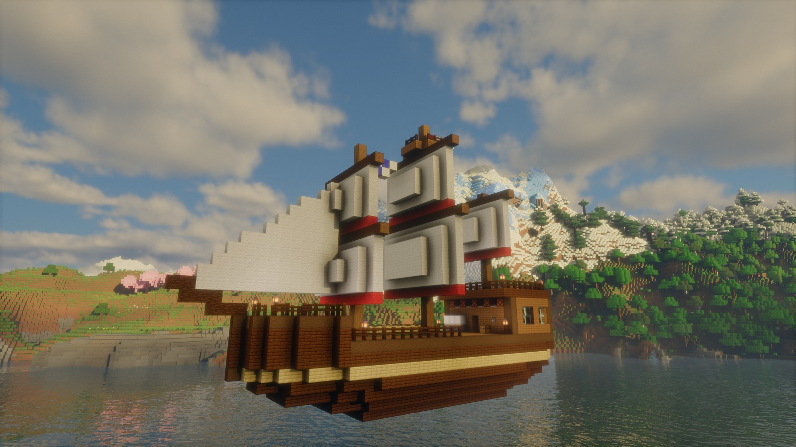
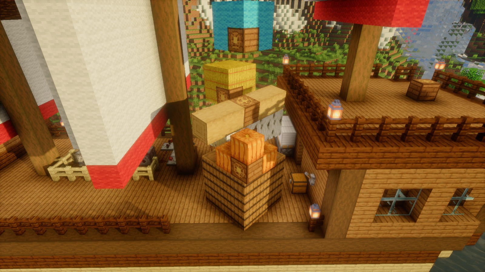
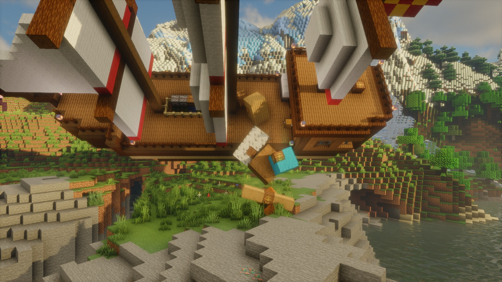
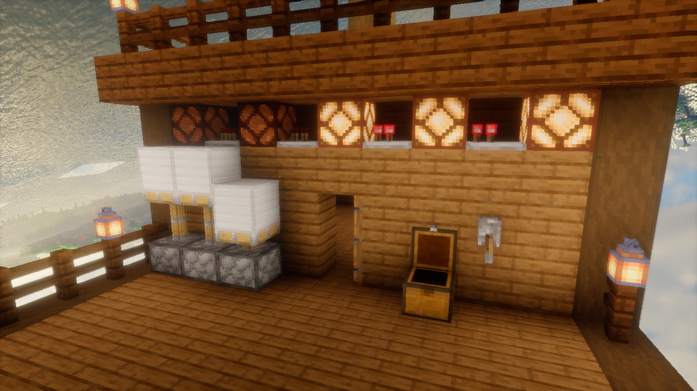
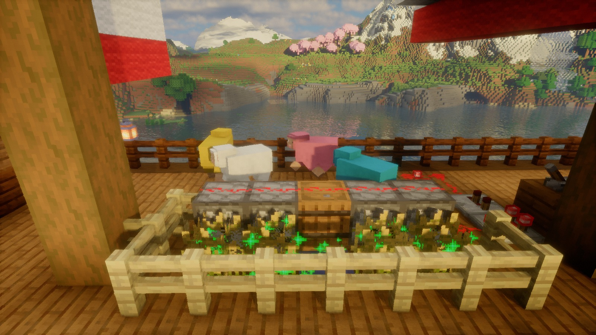
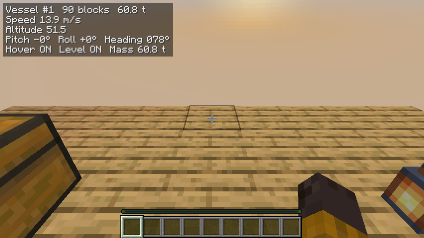

# Slipway

[](https://github.com/TimStewartJ/slipway/actions/workflows/ci.yml)

Moving physics block structures for Minecraft 26.3 (Fabric). Build a structure from any blocks, place a Slipway
Helm on it, assemble it into a vessel and fly it with full pitch, yaw and roll. The blocks stay real blocks: chests,
furnaces, doors, levers, pistons, redstone clocks and farms keep working while the vessel moves, and you can walk on
the deck and build on it at any angle. A vessel can also be let loose as a plain rigid body: cargo that tumbles, lies
on another vessel's deck and slides off when it rolls. With hover off a vessel floats on water by what its hull
displaces, sails as a boat, sinks when it is too heavy or its rim goes under, and whoever is inside a hull that
keeps the water out stays dry (unreleased; see the changelog). Physics by [Jolt Physics](https://github.com/jrouwe/JoltPhysics)
through [jolt-jni](https://github.com/stephengold/jolt-jni). Changes per version are in [CHANGELOG.md](CHANGELOG.md).



| | |
| --- | --- |
|  |  |
| Loose cargo: small vessels land and stack on a vessel's deck... | ...and slide off when it rolls |
|  |  |
| A redstone clock, lamps, pistons, a door and a chest, working while the ship rolls | Dispensers feed bone meal to a wheat bed in flight |

*Stills from the showcase video for 0.1.2. They were rendered inside the game by the film tool ([FILM.md](FILM.md)) with
Sodium, Iris (Bliss shaders) and Distant Horizons; the ship, its redstone and the cargo are generated by code.*

## How this was made: AI-built proof of concept

Slipway was written almost entirely by AI coding agents running through GitHub Copilot, from a design and a set of
goals by [Tim Stewart](https://github.com/TimStewartJ). The agents wrote the code, the tests and the documentation,
ran the test suites, and diagnosed their own bugs, including a world-memory leak traced into Distant Horizons. A
human set the direction, reviewed the results and playtested.

Treat it as a proof of concept: it works and is heavily tested, but it is young, pre-1.0 and maintained on a
best-effort basis. Because of how it was made, it is published here on GitHub rather than on mod platforms whose
rules exclude primarily AI-generated projects.

## Install

1. Minecraft **26.3** with [Fabric Loader](https://fabricmc.net/) 0.19.5 or newer, [Fabric API](https://modrinth.com/mod/fabric-api)
   and **Java 25**.
2. Download `slipway-fabric-26.3-<version>.jar` from [Releases](https://github.com/TimStewartJ/slipway/releases) into
   your `mods` folder.

Optional, all supported: [Sodium](https://modrinth.com/mod/sodium), [Iris](https://modrinth.com/mod/iris) (shaders;
tested with Bliss) and [Distant Horizons](https://modrinth.com/mod/distanthorizons) (far vessels stay visible). With
shaders, use Distant Horizons 3.3.3 or newer: older builds make ordinary world blocks look dark and blotchy on
Minecraft 26.2 and later (a Distant Horizons bug with Iris, fixed in 3.3.3). The jar bundles Jolt's native libraries
for Windows, Linux and macOS (x86_64 and aarch64). Playing is tested on Windows; CI runs the server tests on Linux;
macOS is untested.

Checked combinations for 0.1.3 (production Minecraft, every mixin applied, a vessel assembled, a chest on it opened
by a block event, a vessel set loose): Fabric API only; with Sodium and Iris; with Sodium, Iris and Distant Horizons
3.3.4.

Install it on both the client and the server for multiplayer.

## Playing



*The HUD, as photographed by the automated client tests on a flat test world.*

| Action | How |
| --- | --- |
| Assemble a structure | Build it (any blocks, connected face to face), place a Slipway Helm on it, use (right-click) the helm |
| Take the helm | Use the helm of a vessel. Chat shows the controls with your own key bindings |
| Leave the helm | Sneak |
| Thrust forward / back | Forward / back keys (W / S) |
| Turn (yaw) | Left / right keys (A / D) |
| Up / down | Jump (Space) / **Descend** (Z) |
| Pitch nose up / down | Up / down arrow |
| Roll left / right | Left / right arrow |
| Strafe left / right | N / M |
| Hover on/off | **Toggle hover** (H): on, the ship holds its position, also under cargo and in water; off, gravity applies and water carries what the hull displaces |
| Level on/off | **Toggle level** (B): on, the ship rights itself; off, it holds any attitude, even inverted |
| Loose on/off | **Toggle loose** (U): on, the ship is a plain rigid body: no hover, no levelling, no drag, the helm does nothing; it falls, tumbles and lies where it lands. Off, hover and level apply again as they were set |
| Disassemble | Level the ship (within 20° of level), leave the helm, then sneak and use the helm |

Keys are under Options > Controls > Key Binds > **Slipway**. The Slipway Helm is in the creative inventory under
Functional Blocks (`/give @s slipway:helm`), or crafted from two sticks on top, a compass in the middle and three
planks below. Anything face-connected to the helm becomes part of the vessel, so build ships in the air, on a
temporary platform you remove, or on water (water, kelp and sea grass never become part of a vessel). Operator commands: `/slipway list`, `info`, `stats`, `mode` (`hover`, `level` or
`loose`), `control`, `assemble`, `disassemble` and `remove`; see [PLAYTEST.md](PLAYTEST.md) for details and a guided
list of things to try.

Loose vessels are for cargo: build a few small things over a ship's deck, give each a helm, assemble them and set
them loose (`/slipway mode <id> loose true`, or the key at their helm). They land on the deck, ride along while the
ship flies gently, and slide off when it rolls past about 31 degrees.

### On the water (unreleased)

Turn hover off over water and the vessel floats, sinks or anything between, by its weight and its hull:

- Every block under water is pushed up by the weight of the water it displaces. Wood (700 kg per block) floats,
  earth, stone, glass and metal (1,600 to 7,800 kg) sink, wool and leaves (200 kg) float high.
- **Air that the hull keeps dry displaces water too.** Pour water into the vessel standing upright: every cell that
  would fill is air below a rim, and until the water outside runs over that rim it counts. An open hull of planks, 5
  by 5 with two rows of wall, weighs 40 t and can displace 75 m³, so it carries 35 t of cargo; a hull of stone needs
  to be about 16 blocks square and six high before its air carries its walls. A closed cabin always counts.
- Every block with a collision shape keeps water out (slabs, stairs, glass, doors and trapdoors, open or shut),
  except fences, walls, bars, chains, ladders, banners and lanterns (the block tag `slipway:not_watertight`), which
  make a railing, not a wall.
- When the rim goes under, by overloading or by heeling, the water runs in there and that air stops counting: the
  vessel goes down. The pilot's display shows "Hull displaces 180% of its weight: afloat" (above 100% it floats) and
  warns when water is coming in.
- The helm drives a boat as it flies a ship, slower (about 9 blocks a second) and with a keel: it runs straight and
  does not slide sideways. Level on keeps it upright against any load; with level off the hull's own stability does.
- With hover on, water does nothing to the vessel: it holds its place and flies under water as above it. A closed
  hull with hover off is a submarine that wants to come up: dive with the descend key, or ballast it with iron until
  it displaces little more than its weight.
- Inside a hull that keeps the water out you are dry: you walk, breathe and see as in air, below the waterline and
  under water. Disassembling in the water leaves that air dry, so a docked boat is not full of water; assembling in
  the water closes the sea at once where the hull stood. A hull is put down on kelp and sea grass as on water (the
  block tag `slipway:sea_plants`).

What is tested on a moving vessel, block by block, is listed in [DESIGN.md](DESIGN.md), "What is proven to work on a
moving vessel".

## Known limitations

- The pilot's camera does not roll or pitch with the ship.
- Only blocks are assembled. Standing entities ride along, but hanging entities (item frames, paintings) and mobs are
  not part of the vessel, and mobs do not path-find onto moving decks. Water and lava blocks are not assembled;
  waterlogged blocks keep their water.
- Without shaders, vessel blocks look sky-lit even under a roof or in a cave. With shaders, shadows darken them.
- A vessel changes no light in the world where it flies (its blocks are stored elsewhere): the ground or water under
  a hovering ship is not darkened as it is under the same blocks placed in the world. With shaders a darker patch
  can appear under the hull at the moment the ship is disassembled.
- Distant Horizons draws a far vessel as one coloured box per visible block.
- The block cap is 4,096 per vessel, and a vessel is at most 512 blocks across (`maxVesselBlocks` and
  `maxVesselSpan` in `config/slipway.json`). The size holds after assembly too: a block cannot be placed further
  out, and a piston does not push one there. A block that gets there another way (a bucket of water, a tree growing,
  a command) is not part of the vessel: it is not put into the world when the vessel is disassembled, and it is
  deleted with the vessel.
- Right after assembly the vessel can be drawn incomplete for a tick or two. Right after joining a world, a side of a
  vessel that lies on a chunk border of its storage area (often the west or north side of a small build) can be dark
  for a moment, until the chunk columns around it have arrived; this was not seen in forty world loads in testing.
- Loose vessels: players and mobs do not push them; a deck passes on at
  most 0.6 g, so cargo slides when the carrier stops hard or turns sharply and tall thin pieces fall over; a piece
  sliding fast across a deck can catch on a seam of the deck's collision boxes and tumble.
- On the water (unreleased): the water is flat and still for a vessel (no waves, and a river's current does not carry
  it); a vessel leaves the water as it is (no wake in the blocks, no hole where it floats). Water that has run into
  a hull is not remembered: it is out again as soon as the rim is above the water. Seen from inside a submerged cabin
  the sea outside looks like clear air (the world's water has no faces where the vessel's glass is). The water mask
  that keeps the surface from being drawn inside a hull hides everything translucent behind it, as vanilla's boat
  does: stained glass or particles inside the hull, seen through the waterline from outside. A hovering vessel takes
  no part in any of this. Entities do not weigh a vessel down. In lava a vessel floats higher (and its crew is in
  trouble: only the fluid's push is kept from them, not its heat).
- Pistons do not push entities standing on a vessel. Particles appear at the vessel but do not follow it afterwards. A
  jukebox's music stays where the vessel was when the disc started. Torches, furnaces and other blocks show no
  ambient particles on a vessel.
- Blocks that look for players or mobs near themselves (beacons, conduits, spawners, sculk sensors) have not been
  made to look where the vessel is, and are untested.
- Distant Horizons and Iris can keep memory after you leave a world (Iris with shaders grows native memory by about
  50 to 120 MB per world reopen, with or without Slipway). Restart the game after many world switches.
  Fixes for the Distant Horizons part exist and are being prepared for upstream; `DESIGN.md`, "World retention",
  has the investigation.
- Pre-1.0: saves may not load in later versions.

## Building

Requires Java 25 and Python 3 (for the download script).

```
python tools/fetch-devmods.py   # downloads the pinned Fabric API, Sodium, Iris and Distant Horizons jars into devmods/
gradlew assemble                # mod jar in build/libs
gradlew test runGametest        # unit tests and server GameTests (what CI runs)
gradlew build                   # everything, including the client tests below
gradlew generatePatches         # regenerates PATCHES.md from patches.json after changing a mixin
```

The integration mods are pinned in `tools/devmods.json`. `-PslipwayDevmods=<dir>` reads them from another folder.
Building the same commit again gives the same jar, byte for byte (with the same JDK and the same line endings in the
checkout).

## Testing

All levels run in `gradlew check` (and `build`); CI runs the unit tests, server GameTests and the patch registry
check on every push. Details are in [DESIGN.md](DESIGN.md), "Testing".

- `gradlew test`: unit tests (math, controller, shapes, mass properties, collisions, records, Jolt engine including a
  native leak test with the Debug natives, loose cargo on a carrier in the real engine, hulls and vessels in water
  in the real engine).
- `gradlew runGametest`: Fabric GameTests in a headless server (assembly round trips, deny list, physics, packets,
  interaction, loose vessels, block events and pistons, a repeater clock, a farm, hoppers, observers and droppers,
  floating, sinking, dry hulls and docking in a pool).
- `gradlew runClientGametest`: Fabric client GameTests on a real client with Sodium, Iris (Bliss shaders) and
  Distant Horizons: assembly of a mixed ship, flight through every rotation, deck walking, interaction, collision,
  loose cargo on a carrier, a ballasted hull afloat (the water mask, the player dry below the waterline, thrust on
  the water, flooding), block events (chest lid, piston strokes, note block, mining), a bone meal farm, the
  picture kept at disassembly, forged packets, save and reload, rendering (shadows, reference images, Distant
  Horizons far view), multiplayer with a second client, performance, world-retention leaks and a flight soak.
  Reports in `build/client-gametest`. Needs a
  GPU and the Bliss shader pack (`-PslipwayShaderPack=<zip>`); the window never takes focus.
  `-PslipwaySoakMinutes=20` runs the release soak; `-PslipwayClientGametestOnly=a,b` picks scenarios.
- `gradlew runPackagedJarCheck`: the release jar with the integration mods in production Minecraft; fails on any
  mixin or loader error, and assembles a vessel, opens a chest on it by a block event and sets a vessel loose.
  `-PslipwayPackagedCheckMods=sodium,iris` (or empty for Fabric API only) and
  `-PslipwayPackagedCheckDhJar=<jar>` check other mod combinations.
- `tools/`: the author's local tooling for a Prism play instance and the Prism-based leak isolation matrix
  (`tools/e2e`, Windows, `$env:SLIPWAY_E2E_ROOT`). `validation.json` and `WORKLOG.md` record every run and the
  development history, including local paths from the author's machine.

`PATCHES.md` lists every mixin Slipway applies, with the reason and the test that covers it.

[FILM.md](FILM.md) describes the film tool (`src/film`, `tools/film`, `gradlew runFilm`), which rendered the showcase
video frame by frame inside the real game. It is development only: not part of `assemble`, `check` or the jar.

## License

Apache-2.0. Bundled third-party components (jolt-jni, Jolt Physics, V-HACD) and their licenses are listed in
[NOTICE](NOTICE).
